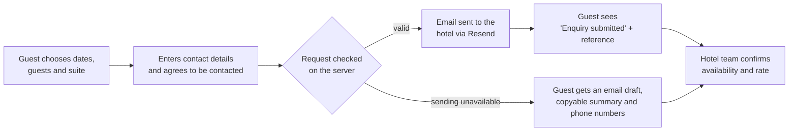

# Wyattel Suite

The official website and reservation-request system for **Wyattel Suite**, a hotel on the National Highway in Tacurong City, Sultan Kudarat, Philippines.

Guests can explore the suites, browse real hotel photography, plan their visit, and send a reservation or event enquiry straight to the hotel team. On phones the site works like a native app and can be installed to the home screen.

---

## What the system does

### For guests

- **Explore the suites:** five suite types (Deluxe, Twin, Presidential, Matrimonial, Family), each with photos, listed rates, and highlights.
- **Request a stay:** choose dates on a calendar, set the number of guests, pick a suite, and send the request in a few steps. No account or payment is needed.
- **Browse the gallery:** the hotel, suites, wedding moments, and the Filipino dining menu, with a full-screen photo viewer.
- **Dining and celebrations:** wedding preparation, events, and dining, each with a direct enquiry.
- **Plan the visit:** directions, contact numbers, an arrival checklist, and answers to common questions.
- **The Journal:** guides on choosing a suite, planning a wedding morning, and a first stay in Tacurong.
- **Offers:** shows only promotions the hotel has approved, with clear dates; otherwise guests can request a personal quotation.

### For the hotel

- Reservation and event requests arrive **by email**, already summarised: dates, guests, suite, contact details, and notes.
- Guests are always told a request is **an enquiry, not a confirmed booking**. The team confirms availability, rates, and arrangements personally.
- If online sending is unavailable, the guest is given a ready-made email draft, a copyable summary, and the hotel's phone numbers, so no enquiry is lost.

---

## How a reservation request works



Every request is checked twice: once in the browser, for instant feedback, and again on the server before anything is sent. That covers valid contact details, consent, a real suite, and connected future dates.

---

## Experience and design

| Area | What it means |
| --- | --- |
| **Phone app experience** | Bottom tab bar (Home, Suites, Book, Gallery, More), app-style top bar with back buttons, swipeable photo cards, and bottom sheets that can be dragged down to close. Suite pages work like a booking app, with a pinned "Request this suite" bar. |
| **Installable** | "Add to Home Screen" opens the site full-screen with its own Wyattel icon, like a native app. |
| **Desktop** | Editorial layout with large photography, a hover-preview suite index, and a booking window whose suite photo expands into a full gallery. |
| **Visual identity** | Navy, cream and gold taken from the hotel's own interiors, with Cormorant Garamond and Montserrat type. |
| **Accessibility** | Meets WCAG AA colour contrast, works fully by keyboard (including the date calendar and photo viewers), has labelled form fields and screen-reader announcements, and respects "reduce motion" settings. |
| **Performance** | Photos are automatically converted to responsive WebP, so the homepage image drops from 2.3 MB to about 24 KB on phones. Pages load the right image size for each screen. |

---

## Tech stack

| Layer | Technology |
| --- | --- |
| **Frontend framework** | [React 18](https://react.dev) |
| **Language** | [TypeScript 7](https://www.typescriptlang.org) (strict mode) |
| **Build tool / dev server** | [Vite 6](https://vite.dev) |
| **Styling** | [Tailwind CSS 4](https://tailwindcss.com), with a custom brand design system |
| **Icons** | [Lucide](https://lucide.dev) |
| **Typography** | Cormorant Garamond and Montserrat (Google Fonts) |
| **Backend / API** | Serverless function on [Vercel](https://vercel.com) (Node.js) |
| **Email delivery** | [Resend](https://resend.com) |
| **Hosting** | Vercel |
| **Image processing** | [sharp](https://sharp.pixelplumbing.com) (build-time WebP generation) |
| **Installable app** | Web App Manifest with home-screen icons |
| **Testing** | Node.js built-in test runner, with server rendering to check pages |

---

## Security and privacy

- **No payments or accounts.** The site never collects payment details or passwords.
- **Secrets stay on the server.** The email-service key and the hotel's inbox address are server-only environment variables and never reach the browser.
- **Spam and abuse protection.** The enquiry endpoint uses a hidden spam trap, size limits, same-site checks, rate limiting, and duplicate-submission protection.
- **Honest content.** No invented reviews, discounts, policies, or "live availability" claims. Rates are shown as listed reference rates that the hotel confirms.

> The built-in rate limit is per server instance. Before a high-traffic launch, enable your host's abuse protection as well.

---

## Getting started

Requirements: **Node.js 20+** and npm.

```sh
npm ci            # install dependencies
npm run dev       # run the site and enquiry API locally
npm test          # run the test suite
npm run build     # optimise photos, type-check, and build for production
```

To open the local site on a phone on the same Wi-Fi, run `npm run dev -- --host` and use the "Network" address it prints.

## Configuration

Copy `.env.example` to `.env.local` (never committed) and fill in:

| Variable | Purpose | Visibility |
| --- | --- | --- |
| `RESEND_API_KEY` | Resend API key used to send enquiry emails | Server only, keep secret |
| `RESERVATION_TO_EMAIL` | Hotel inbox that receives enquiries | Server only |
| `RESERVATION_FROM_EMAIL` | Sender address on a domain verified with Resend | Server only |
| `VITE_ENQUIRY_EMAIL` | Address used for the guest's fallback email draft | Public (visible in the browser) |

Without the server variables the site still works, and enquiries fall back to the email draft.

## Deployment

The site deploys to **Vercel** from the `main` branch. Add the variables above under *Project → Settings → Environment Variables*. Vercel serves the pages and runs the enquiry API automatically.

---

## Content guidelines

- Show only hotel-approved rates, capacities, policies, and offers. Anything unconfirmed is labelled as such.
- Offers appear only while approved and within their dates.
- Journal articles are planning guides, not testimonials. Publish guest stories only with permission.
- Current suite photos are placeholders until new photography is taken. Suites without their own photos display a clearly labelled representative image.
